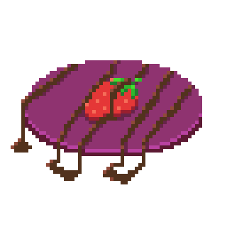

# crepe-bordeaux
The cross-platform clipboard cli tool




Copy:
```console
$ echo "foo" | cb
```


Paste:
```console
$ cb
foo
```

No clipboard available? `cb` will write to a .txt file in the folder determined by Rust's [std::env::temp_dir](https://doc.rust-lang.org/std/env/fn.temp_dir.html).

Want to use a different folder? Set the environment variable CB_DIR.